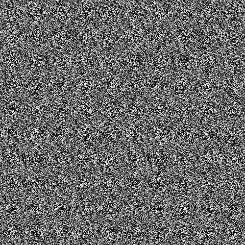

## Perlin Noise
Generate a gray image use 3D Perlin Noise

The image which was generated is here:

About Perlin Noise, read this [pdf](https://wangtingzheng.github.io/docs/pdf/ComputerGraphics/PerlinNoise.pdf)
